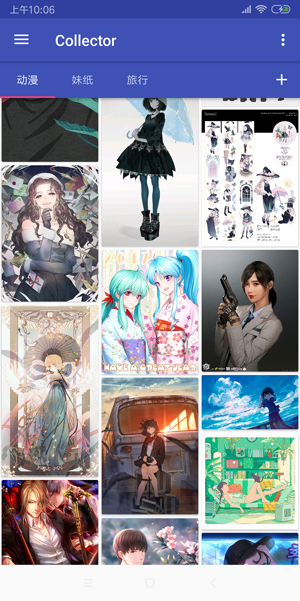

# Collector
Collector是一个简单的图片浏览APP，整体功能简单朴素，可以分频道浏览网友分享的图片素材，并提供下载的功能。

App主要集成了以下组件：

## LightKV
项目地址：[LightKV](https://github.com/No89757/LightKV)  
高性能key-value存储组件，相比SharedPreferences有全方位的改进  
支持Kotlin属性委托，在Kotlin环境下使用，可以像读写变量一样读写配置  
推荐指数：★★★★

## LightEvent
项目地址：[LightEvent](https://github.com/No89757/LightEvent)  
轻量级事件通信方案(类似于EventBus的作用），不到50行代码  
简单到极致，使用也很方便。 
推荐指数：★★★

## Task
项目地址：[Task](https://github.com/No89757/Task)  
实用的线程调度框架，针对App开发的使用场景做了适用性封装  
支持优先级，适配生命周期，支持任务分组，任务去重  
可直接执行任务，可用于RxJava, 可替换AsyncTask  
推荐指数：★★★★

## Doodle
项目地址：[Doodle](https://github.com/No89757/Doodle)  
高效的图片加载框架。 
功能完备，实现清晰。 
推荐指数：★★★★★

# 效果图

# 声明
感谢[花瓣网](https://huaban.com/)和[unsplash](https://unsplash.com/)两个图片平台，让大家可以方便地分享和检索图片素材。 
此项目为演示和学习的用途，若存在版权问题请联系删除。

# License
See the [LICENSE](LICENSE.md) file for license rights and limitations.
